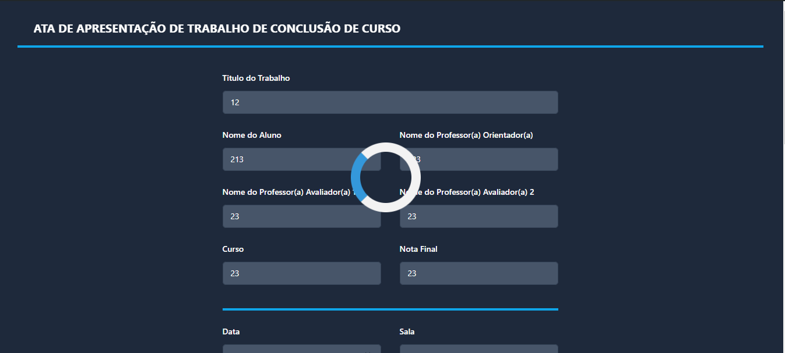

# Projeto: Remake de site/app web

Acesso: https://proejto-1.onrender.com

#### Desenvolvedor(a)
Bruna Caetano - Sistemas de informacao

#### Site/app escolhido

##### Link
https://andreainfufsm.github.io/avaliatcc/atacc/

##### Descrição e Desenvolvimento
O site escolhido foi o site de geracao de atas de apresentacao de TCCs. O site foi escolhido pois acredito que a interface pode ser melhorada, tornando-a mais intuitiva e agradavel para o usuario. Alem disso, acredito que a interface pode ser mais responsiva, para que o usuario possa acessar o site de qualquer dispositivo. O codigo do site original era feito com a biblioteca bootstrap, porem, para o remake, optei por utilizar o framework tailwindcss, pois acredito que ele facilita a estilizacao do site e possui o modo noturno de forma mais simples. Na parte do javascript, nao houve grandes alteracoes. Adicionei o loader do botao e mudei os nomes dos ids que alterei no html. Os codigos originais consegui retirar a partir da aba de rede do inspecionar do navegador.

#### Tecnologias

- HTML
- CSS
- Tailwindcss
- jspdf

#### Ambiente de desenvolvimento

- WebStorm

#### Referências e créditos

- https://tailwindcss.com/
- https://stackoverflow.com/questions/39745891/how-to-create-a-loader-in-javascript-waiting-for-a-function-to-end

---
Projeto entregue para a disciplina de [Desenvolvimento de Software para a Web](http://github.com/andreainfufsm/elc1090-2024a) em 2024a